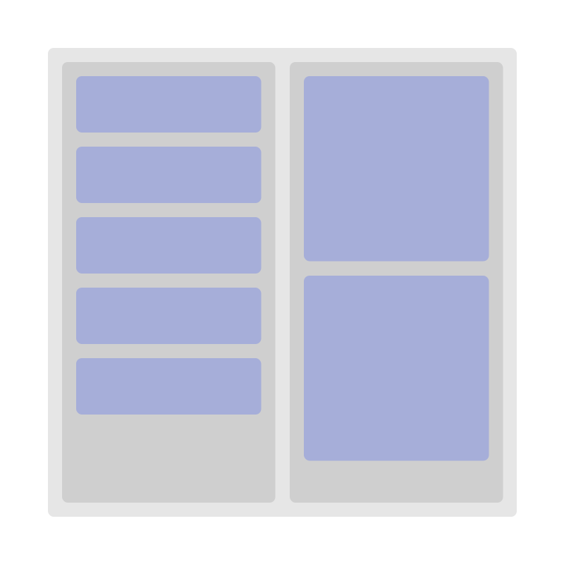

# The Element Hierarchy

In Blueprint, Elements are the building blocks that are assembled together to create UI.

If you have experience building iOS apps, we can compare elements to `UIView`s:

**Elements are similar to views:**
- Elements and views both cover some area of the screen
- Elements and views can both display visual information and respond to user input
- Elements and views can both contain children, where the parent is responsible for laying out those children.

**Elements are different from views:**
- Views are long lived (classes), whereas elements are Swift value types


Any useful UIKit app uses more than one view. Every bit of content, every bar, and every button within that bar – they are all implemented as views.

Likewise, building UI with Blueprint usually involves working with multiple elements.

`BlueprintView` is a view that you can use to display Blueprint elements on screen. It is initialized with a single element:

```swift
public final class BlueprintView: UIView {
    public init(element: Element?)
}
```

The element displayed by `BlueprintView` is the "root" element of the hierarchy. Its child elements, and all of their descendents, form the entirety of the element hierarchy.

### How the element hierarchy is displayed

#### 1. Layout

The first step is to calculate layout attributes for the entire element hierarchy.


#### 2. View-backed elements

Elements can optionally provide a [`ViewDescription`](../Reference/ViewDescription.md). If so, that element is considered "view-backed", and it will be displayed with a concrete system view. Elements shaded in blue below are view backed.




#### 3. View hierarchy update

After the hierarchy has a fully computed layout, and some elements have chosen to be view backed, the hierarchy is *flattened*.

This means that every element that is *not view backed* is removed – its layout attributes are applied to its children so that they still appear in the same location on-screen.

Now that we have a flattened tree that only contains views to be displayed, we traverse the view hierarchy (inside of `BlueprintView`) and update all views to match the new view descriptions.

The flattening step allows element hierarchies to be as deep as necessary without compromising performance. It becomes very cheap to introduce extra layers in the hierarchy for layout purposes, knowing that this will not complicate the view hierarchy that is ultimately displayed.


